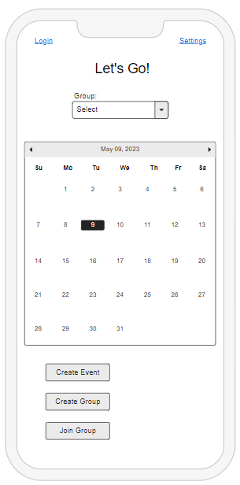
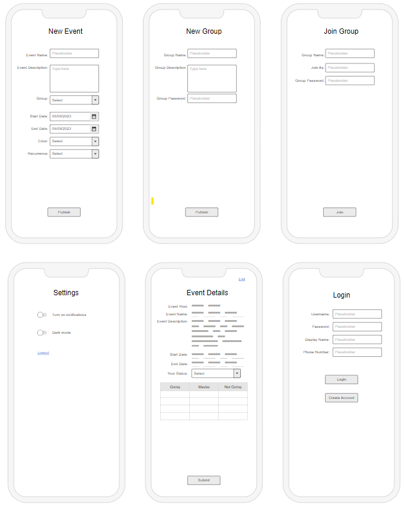

# startup
CS 260 startup project

## Startup Deliverable - Let's Go!

### Elevator pitch

I have always been the friend in a group that has to plan hang outs, movie night, or any group activity. But it is always a hassle to get everyone on the same page. I usually have to text people individually to get their availabilit, or I would have to use a calendar like Outlook or Google, but honestly that stuff is already just cluttered with school or work things. So my app, Let's Go!, is a calendar app that simplifies the process of making plans and inviting people to them. This makes making plans hassle free, and with it, you will have a calendar full of fun for you and all your friends.

### Design

I want to use an application design that is simple, easy to use, and not too cluttered.

This shows the initial screen one would come across with opening the application. It includes the calendar, the options to create new events and groups, join a group, and other settings.

Here are the other screens I plan to implement with the application, from settings, to seeing event details. There may be some parts that I may be currently neglecting, or oversimplifying, but this is the jist of what the app will look like when navigating it.